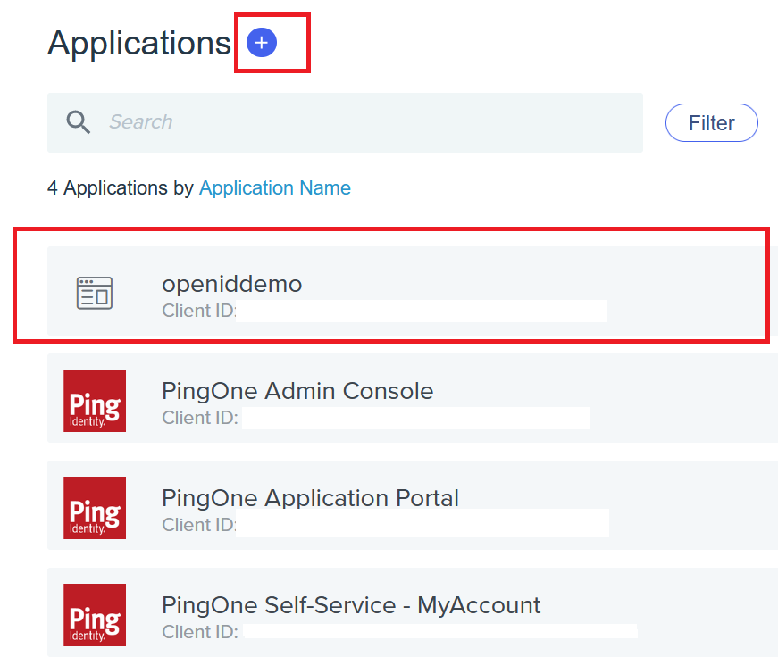
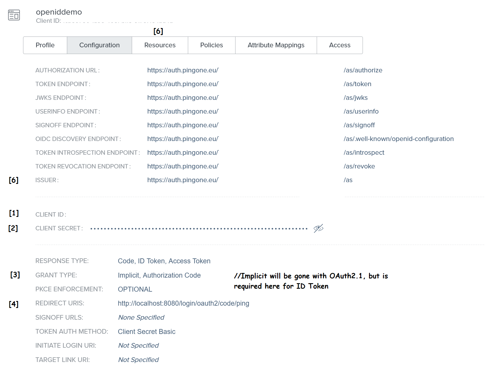
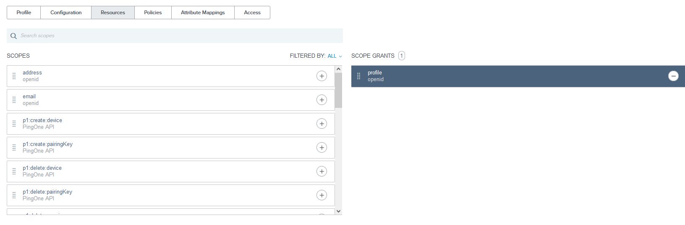

# Access Management - Code Samples

The idea of this repository is that you have a quick understanding of how you can connect to a common Access Management Software in Java (Spring) avoiding fancy plugins so that you can get a plain/raw understanding how to get started.

In this tutorial series I use the Spring Framework (Spring Security) with a Tomcat. 

So for the beginning, you will find samples how to connect your programs to a specific vendor software (mostly written in Java).
Have fun. 8)

 

# First Example - Ping Identity

We want that a user connects with an application to Ping Identity and then obtains the Access Token for further use.
The Access Token is not enough and we want more information about the User and therefore we want to request the ID Token as well.
Which means OAuth 2.0 is not enough and we use an OpenID Connect (OICD) layer on top. We want the Profile of the User.

## Requirements

<ul>
<li>IDE with Maven support</li>
<li>Ping Identity (PingOne) Instance</li>
<li>Some test identities</li>
</ul>

## Setup of Ping Identity
For this tutorial we work with PingOne SSO.

<ol>
<li>Follow the getting started tasks and create a custom sign-on form (look's better)</li>
<li>If not already happened, create an environment/li>
<li>Go to Connections. Go to Applications. Create your application with the plus sign, which is then the Service Provider.
 
 This is the application you want to give your custom (demo) application access to.</li>
</ol>

## Ping Identity - Applications
 

## Details of openiddemo application
Here you can see the generated URLs with the IDs. The brackets show which is relevant for your application.yml
 

 

## Details of Resources tab
On the right you can see that the scope profile is selected. Openid is always selected, but must be mentioned in the application.yml
 

